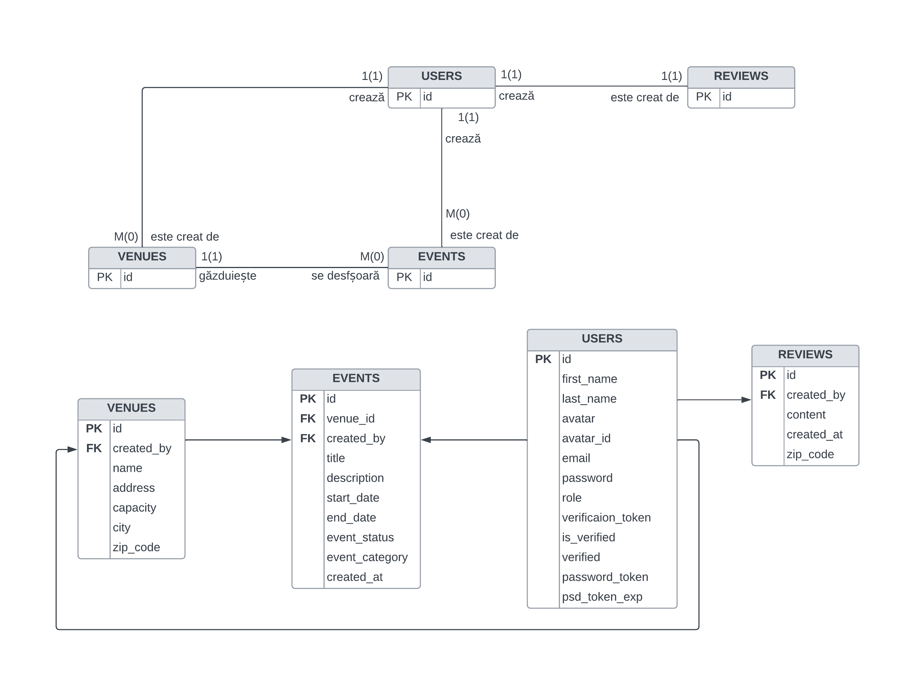
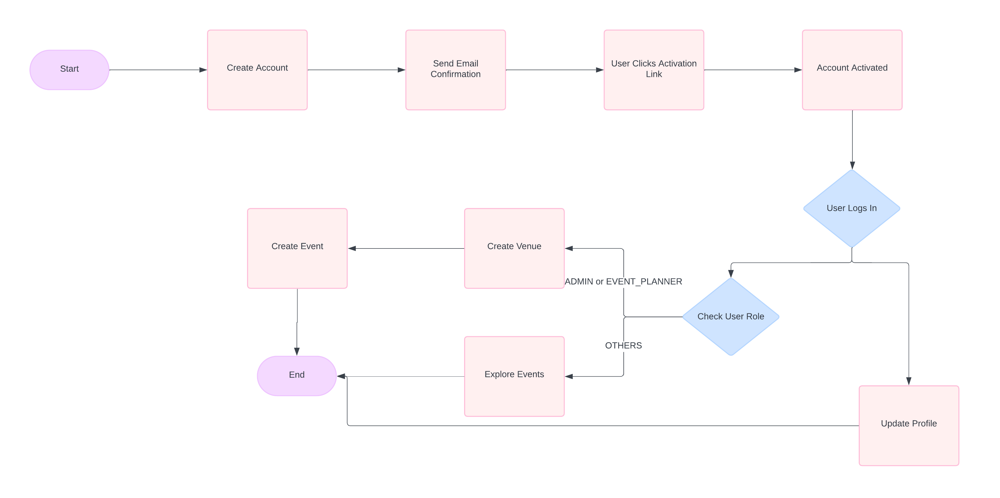

# LocalEcho - Proiect Node.js


## Setup-ul Proiectului

Pentru a rula aplicația local, urmați pașii de mai jos:

### Instalarea Dependințelor

Pentru a instala toate dependințele necesare pentru server și client, rulați următoarea comandă:

```bash
npm run setup-project
```

### Pornirea Serverului

Pentru a porni serverul Node.js folosind Nodemon:

```bash
npm run server
```

Pentru a porni partea de frontend:

```bash
npm run client
```

Pentru a rula întreaga aplicație:

```bash
npm run dev
```

### Explicare .env 

- NODE_ENV: Aceasta variabila specifica in ce mediu ruleaza aplicatia: development, testing sau production
- PORT: Portul pe care serverul va asculta pentru cereri HTTP
- DATABASE_URL: URL-ul de conectare la baza de date
- JWT_SECRET: Cheia secreta utilizata pentru semnarea si verificarea token-urilor JWT
- JWT_LIFETIME: Durata de viata a token-urilor JWT emise pentru autentificare
- CLOUD_NAME, CLOUD_API_KEY, CLOUD_API_SECRET: Credentialele necesare pentru a accesa serviciul de stocare si gestionare a imaginilor in cloud (Cloudinary).

### Diagrama Bazei de Date



### Swagger
 
## Flow Chart Diagram




